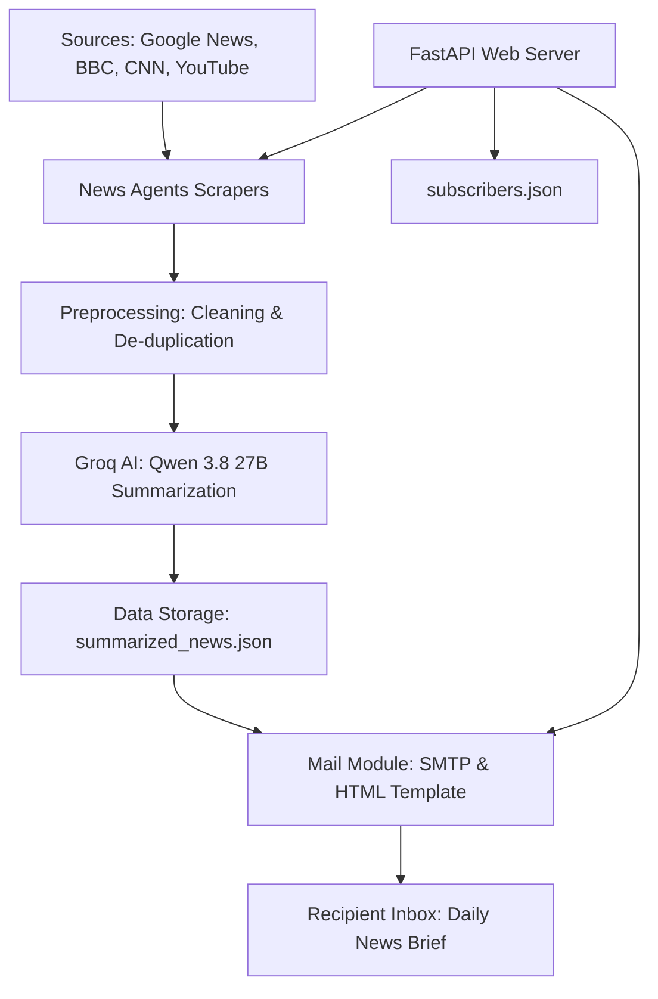

# NewsCraft - AI-Powered Daily News Agent

NewsCraft is an automated AI news agent that aggregates, summarizes, and delivers a personalized daily news brief directly to your inbox. It features a robust multi-source scraping pipeline, customizable user topics, a stunning glassmorphism subscription UI, and is fully accessible via FastAPI.

## 🚀 How It Works

NewsCraft orchestrates a multi-step AI pipeline to transform raw news into a personalized daily brief for every subscriber.

### Architecture Flow



### Key Features

1.  **Stunning Subscription UI**: A high-end, responsive dark-mode web interface for users to subscribe and select their favorite topics (Politics, Sports, AI, Tech, Business, Entertainment).
2.  **Smart Aggregation**: Simultaneously pulls the latest stories from Google News (by genre), BBC News, CNN, and YouTube Transcripts.
3.  **AI Summarization Engine**: Leverages **Groq's** high-speed inference (using `qwen/qwen3.8-27b`) and **LangChain** to generate human-like, strictly 3-4 line summaries.
4.  **Automated Delivery**: Articles are injected into a sleek, mobile-responsive HTML email template (complete with "Read full story" links and unsubscribe preferences) and dispatched via SMTP.
5.  **Multi-user Support**: Uses `subscribers.json` to store user-specific genres and automatically personalizes the newsletter for each user.

## 📂 Project Structure

*   `main.py`: The entry point orchestrator that runs the entire pipeline locally.
*   `FAST_API/api.py`: FastAPI web controller that serves the UI and subscription endpoints.
*   `FAST_API/static/index.html`: The beautiful frontend UI.
*   `app.py`: Core AI summarization logic.
*   `News_Agents/`: Specialized scrapers.
*   `Preprocessing/`: Data cleaning, formatting, and deduplication logic.
*   `Mail_SMTP/`: Email templating and SMTP delivery system.
*   `summarized_news.json` & `subscribers.json`: Local cache and database.

## 🛠️ Instructions to Run Locally

### 1. Prerequisites
*   Python 3.10+ installed.
*   A **Groq API Key** (for the LLM).
*   A **Gmail App Password** (for sending emails).

### 2. Installation
1.  Clone the repository.
2.  Install the required dependencies:
    ```bash
    pip install -r requirements.txt
    ```

### 3. Configuration
1.  Rename `.env.example` to `.env`.
2.  Open `.env` and fill in your details:
    ```ini
    GROQ_API_KEY=your_groq_api_key
    LANGCHAIN_TRACING_V2=true
    LANGCHAIN_API_KEY=your_langchain_api_key
    
    GMAIL_USER=your_email@gmail.com
    GMAIL_APP_PASSWORD=your_app_password
    NEWSCRAFT_API_KEY=your_secret_key_here
    ```

### 4. Running the Web App (UI)
To launch the beautiful subscription UI and backend server:
```bash
python FAST_API/api.py
```
Then visit **http://127.0.0.1:8000/** to view the app and subscribe!

### 5. Running the Pipeline Manually
To trigger the AI to fetch news, summarize it, and email all subscribers immediately:
```bash
python main.py
```

